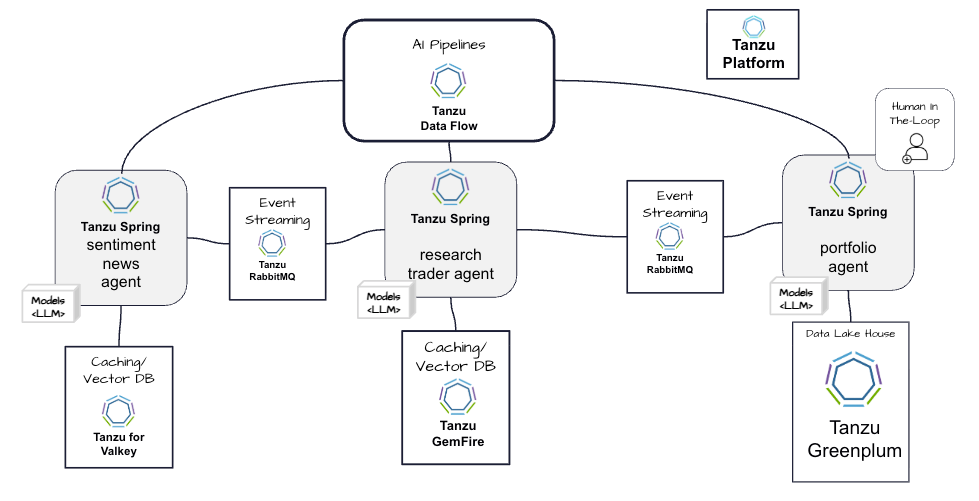

# financial-trading-ai-agentic-showcase

Spring AI super for agenticAI
Java
Python for data scientist - Not being use for critical realtime solutions
EASY TO DEVELOP

Valkey use for caging and advice for determine whether a sock is bullish or bearish

Gemfire dispute compute and ADVICE for trades

A green plum, which is based on post grass is used by the portfolio agent to provide analytics on potentially large amounts of data set  assets

