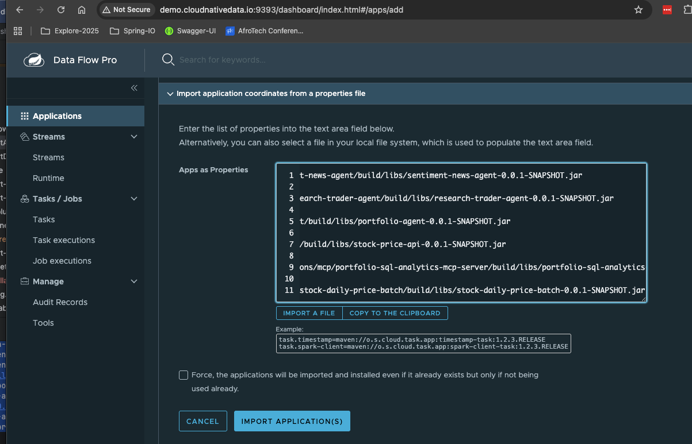
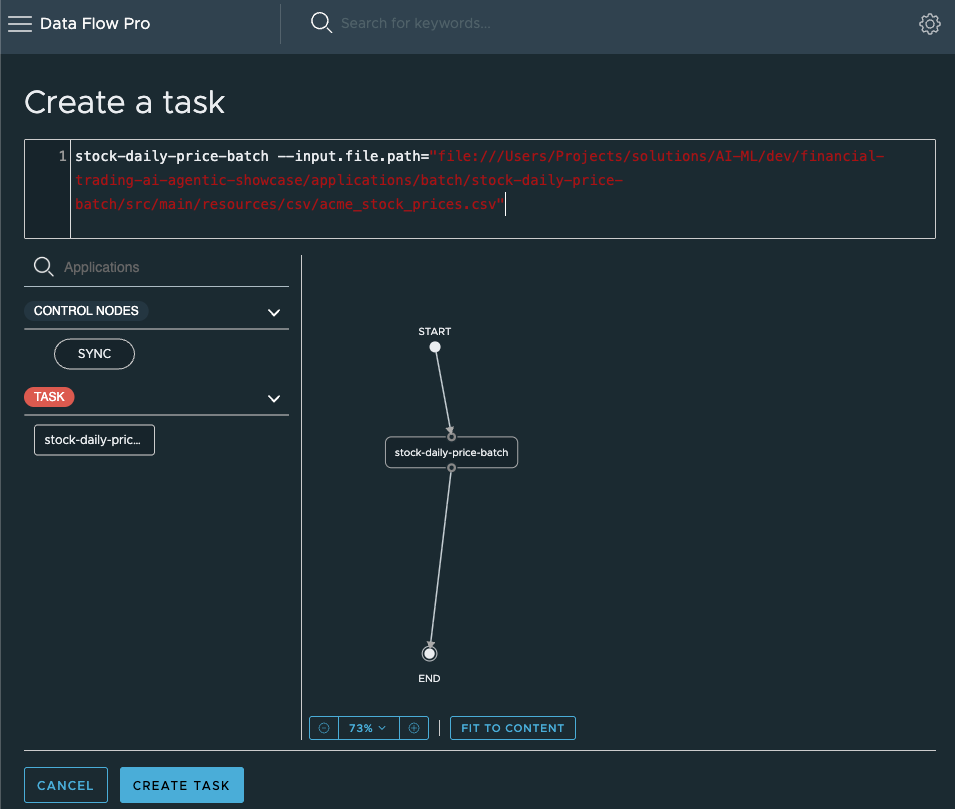
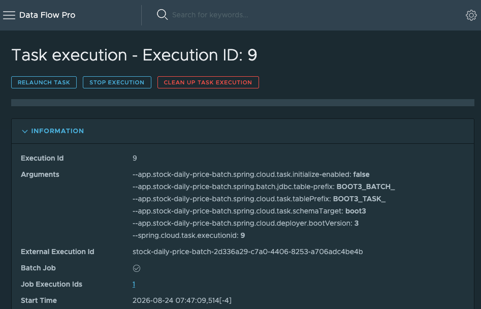
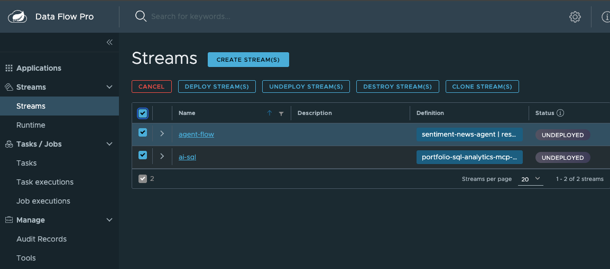
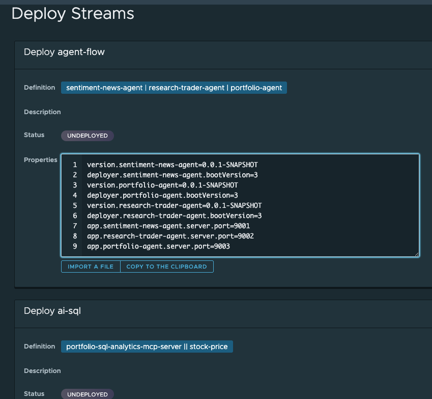

# Getting started


Start Podman (tested with 20 GB memory)

If running stop Podman (podman machine stop)
```shell
podman machine stop
podman machine set --memory 32000
podman machine start
```
Start Ollama

```properties
deployments/local/start-ollama.sh
```

Pull embed large

```shell
podman exec -it ollama ollama pull mxbai-embed-large
podman exec -it ollama ollama pull llama3
podman exec -it ollama ollama pull gpt-oss:20b
podman exec -it ollama ollama pull mistral
podman exec -it ollama ollama pull gemma
```

Or 

Docker


```shell
docker exec -it ollama ollama pull mxbai-embed-large
docker exec -it ollama ollama pull llama3
docker exec -it ollama ollama pull gpt-oss:20b
docker exec -it ollama ollama pull mistral
docker exec -it ollama ollama pull gemma
```


Start GemFire 

```shell
deployments/local/gemfire/start-gemfire-local.sh
```


GMC

```shell
deployments/local/gemfire/start-gmc-gideon-console.sh
```


Valkey

```shell
deployments/local/start-valkey.sh
```

Start RabbitMQ 

```shell
deployments/local/start-rabbitmq.sh
```

Start Postgres

```shell
deployments/local/start-pg.sh
```


Start Greenplum

```shell
deployments/local/greenplum/start-greenplum.sh
```

Start Data Flow

```shell
deployments/local/dataFlow/startDataFlow.sh
```


Open Data Flow UI

```shell
open http://demo.cloudNativeData.io:9393/dashboard
```


Get Apps registration UI

```shell
deployments/local/dataFlow/printAppProperties.sh
```

Register using Data Flow UI




"ACME_WELL", "ACME_SPORT","ACME_INS","ACME_PHARMA","ACME_TELCO"

Task


## run demo


Launch tasks/batch in Data Flow UI

Click Tasks-> Create Task





Copy Definition

```properties
stock-daily-price-batch --input.file.path="file:///Users/Projects/solutions/AI-ML/dev/financial-trading-ai-agentic-showcase/applications/batch/stock-daily-price-batch/src/main/resources/csv/acme_stock_prices.csv"
```


Click Create Task 


Use name

```properties
name=stock-daily-price-batch
```

Launch Job




Open GMC

```properties
open http://demo.cloudnativedata.io:7077
```

See daily stock pric


Now deploy stream


```text
agent-flow=sentiment-news-agent  --server.port=9001 | research-trader-agent --server.port=9002 | portfolio-agent --server.port=9003
ai-sql=portfolio-sql-analytics-mcp-server --server.port=9077 || stock-price --server.port=9999
```

Deploy streams








## Ingest News

```properties
TICKER=ACME-CAR
NEWS=Recently we have heard news of stock manipulation by this company.

```


Add Context

```properties
context=stock manipulation is BEARISH
summary=Stock Manipulation: Corporation Leadership Trust Concerns
```

```properties
name=ACME-HOSPITAL
NEWS=Doctors are making up phony results that are stock trust concerns because of manipulate
```

```properties
name=ACME-TAX
NEWS=Tax preparers are providing fake and or often false results
```

Add Context 

```properties
NEWS=ACME
summary=Fraud Manipulation: Corporation Trust Concerns
```

```properties
deployer.research-trader-agent.local.javaOpts=-Dspring.cloud.stream.rabbit.default.consumer.containerType=stream -Dspring.cloud.stream.rabbit.bindings.input.consumer.containerType=stream -Dspring.cloud.stream.rabbit.bindings.output.consumer.containerType=stream -Dspring.cloud.stream.rabbit.bindings.output.producer.producerType=STREAM_SYNC
deployer.portfolio-agent.local.javaOpts=-Dspring.cloud.stream.rabbit.default.consumer.containerType=stream -Dspring.cloud.stream.rabbit.bindings.input.consumer.containerType=stream -Dspring.cloud.stream.rabbit.bindings.output.consumer.containerType=stream
deployer.sentiment-news-agent.local.javaOpts=-Dspring.cloud.stream.rabbit.default.consumer.containerType=stream -Dspring.cloud.stream.rabbit.bindings.input.consumer.containerType=stream  -Dspring.cloud.stream.rabbit.bindings.output.producer.producerType=STREAM_SYNC

version.sentiment-news-agent=0.0.1-SNAPSHOT
deployer.sentiment-news-agent.bootVersion=3
version.portfolio-agent=0.0.1-SNAPSHOT
deployer.portfolio-agent.bootVersion=3
version.research-trader-agent=0.0.1-SNAPSHOT
deployer.research-trader-agent.bootVersion=3
app.sentiment-news-agent.server.port=9001
app.research-trader-agent.server.port=9002
app.portfolio-agent.server.port=9003


```


Open

GemFire Management Console
- http://demo.cloudNativeData.io:7077

Open RabbitMQ

- http://demo.cloudNativeData.io:15672

Sentiment News AI App

- http://demo.cloudNativeData.io:9001

Trader Agent 
- http://demo.cloudNativeData.io:9002

Portfolio Agent

- http://demo.cloudNativeData.io:9003


IA

- What are the highest 3  stocks by price
- What is the lowest 2 stock by price
- What is that top 3 stocker based on a BUY tradeProposal
